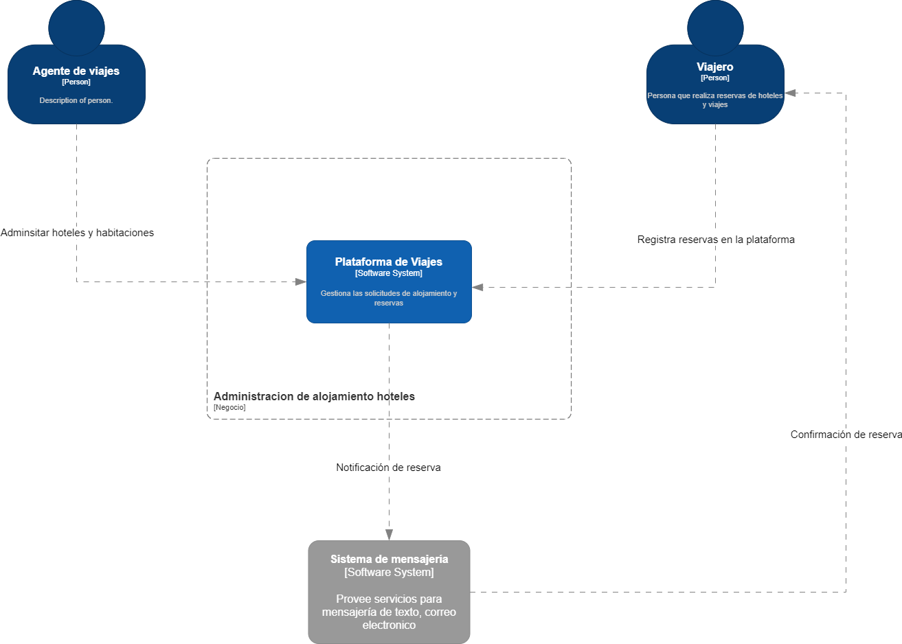
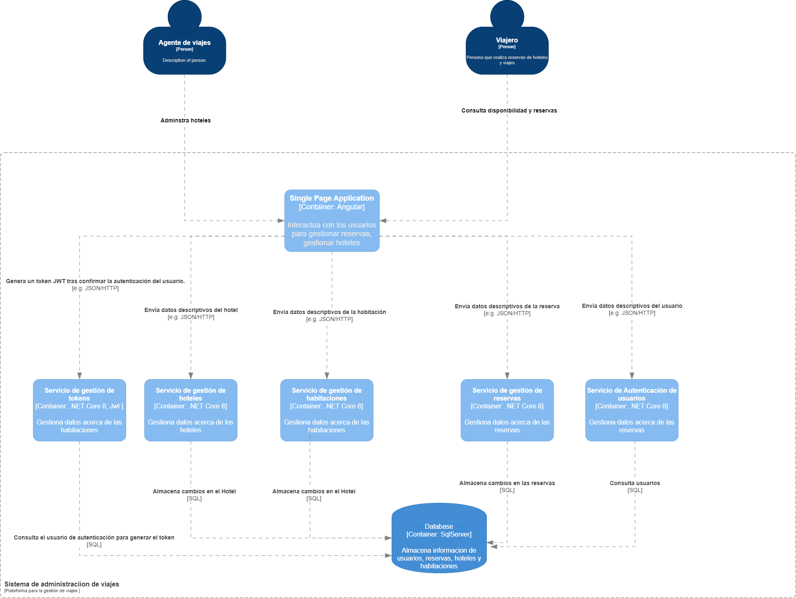
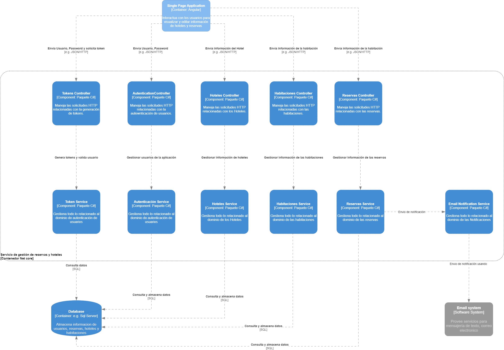
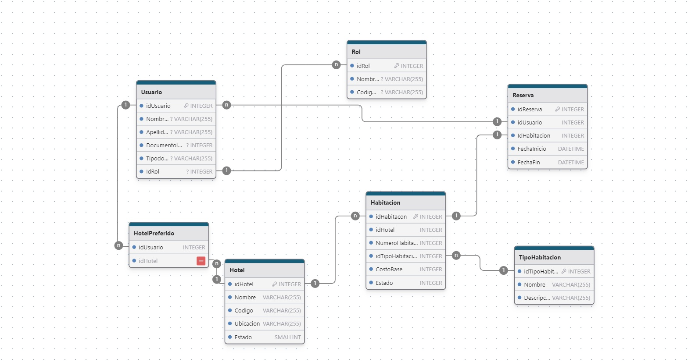
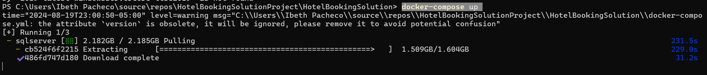

# HotelBookingSolution

Este proyecto implementa una solución para la gestión de reservas de hoteles, utilizando una arquitectura orientada al dominio (DDD) con .NET Core.

## Índice

1. [Descripción General](#descripción-general)
2. [Arquitectura](#arquitectura)
3. [Diagrama de Contexto](#diagrama-de-contexto)
4. [Diagrama de Contenedores](#diagrama-de-contenedores)
5. [Diagrama de Componentes](#diagrama-de-componentes)
6. [Configuración](#configuración)
7. [Git Flow](#git-flow)
8. [Dependencias del proyecto](#dependencias-del-proyecto)
9. [Docker](#docker)
10. [GithubActions](#Actions)
11. [Licencia](#licencia)

## Descripción General

El proyecto **HotelBookingSolution** tiene como objetivo proporcionar una plataforma para la administración de reservas de hoteles. Está diseñado siguiendo los principios de Domain-Driven Design (DDD) y utiliza .NET Core para la implementación de servicios.

## Arquitectura

La solución sigue una arquitectura orientada al dominio con las siguientes capas:
- **Domain**: Contiene la lógica de negocio y las entidades del dominio.
- **Application**: Contiene la lógica de la aplicación y los casos de uso.
- **Infrastructure**: Maneja la persistencia de datos y las interacciones con servicios externos.
- **API**: Expone los endpoints para interactuar con la aplicación.

## Diagrama de Contexto

Este diagrama muestra la interacción de los usuarios con el sistema y los sistemas externos:



## Diagrama de Contenedores

Este diagrama muestra los diferentes contenedores (microservicios, bases de datos, etc.) que componen la aplicación:



## Diagrama de Componentes

Este diagrama detalla los componentes dentro de cada contenedor:



## Diagrama de Base de Datos

Este diagrama detalla el modelo de la base de datos:



## Configuración

## Git Flow
Este proyecto utiliza git flow para la gestion del branching como se explica en el ejemplo.

Deben existir dos ramas principales para que el flujo de trabajo funcione correctamente:

 

master
develop
GitFlow creará por defecto los siguiente prefijos para las ramas auxiliares, los cuales ayudan a identificar y tener control en el repositorio:

- feature/
- release/
- hotfix/
- bugfix/
- support/
Se recomienda agregar un prefijo a las etiquetas, por ejemplo, la letra «v» sin comillas.

### Requisitos

- .NET Core 8
- Docker
- Git
- SQL Server
## Dependencias del proyecto
1. lista de dependencias
   ```bash
   AutoMapper.Extensions.Microsoft.DependencyInjection
   BCrypt.Net-Next
   coverlet.collector
   Microsoft.AspNetCore.Authentication.JwtBearer
   Microsoft.AspNetCore.Mvc.NewtonsoftJson
   Microsoft.EntityFrameworkCore.Design
   Microsoft.EntityFrameworkCore.SqlServer
   Microsoft.Extensions.Configuration.Json
   Microsoft.Extensions.Configuration.UserSecrets
   Microsoft.NET.Test.Sdk
   Microsoft.Playwright.MSTest
   Microsoft.VisualStudio.Azure.Containers.Tools.Targets
   Moq
   MSTest.TestAdapter
   MSTest.TestFramework
   Swashbuckle.AspNetCore
   xunit

### Instrucciones de Configuración

1. Clona el repositorio:
   ```bash
   git clone https://github.com/tu-usuario/HotelBookingSolution.git
2. Debe tener instalado Docker en el equipo si no lo puedes descargar de la siguiente url:
   ```bash
   https://www.docker.com/
3. Debe  tener instalado Sqlserver en el equipo si no lo puedes descargar de la siguiente url:
   ```bash
   https://www.microsoft.com/es-co/sql-server/sql-server-downloads

4. Debe  tener instalado el ide visual studio o visual Studio code en el equipo si no lo puedes descargar de la siguiente url:
   ```bash
   https://visualstudio.microsoft.com/es/downloads/

5. Abrir el proyecto en visual studio y compilarlo, crear la base de datos HotelReservationsDB  y configurar  la base de datos  parametrizar el usuario en el archivo app.settings y ejecutar el siguiente comando :
   ```bash
   update-database en la consola de paquetes nugets
6. Para agregar una nueva migración se debe abrir la terminal ingresar en la ruta del paquete infraestructure y ejecutar el siguiente comando:
   ```bash
   dotnet ef migrations add Nombre de la migración --startup-project ../WebApi.csproj
7. esto crea datos por default para probar la aplicación el pass del usuario es:
   ```bash
   Email soulreavers214@gmail.com Password "Taylor/1214."
   Endponit de generacion de tokens 
   http://localhost:62329/login
## Docker
8. en la configuracion de docker se utilizó la configuración sugerida por visual studio  con la siguiente imagen
   ```bash
   mcr.microsoft.com/dotnet/aspnet:8.0-nanoserver-1809;
para realizar la prueba de docker en local se debe compilar desde visual studio el docker este descarga las dependencias y agrega la imagen al repositorio local de contenedores  luego desde el docker dekstop le das run o con el comando docker run -p 5000:8080 nombre de la imgen
 para probar desde el docker compose se debe navegar hasta la raiz del proyecto donde esta el docker compose y elecutar el si guiente comando. 
-  docker-compose up 
10.   debe salir algo similar a esto

se crean las imagenes necesarias para el funcionamiento de la aplicación
## GithubActions

- name: Define el nombre del flujo de trabajo. En este caso, es "Build and Deploy .NET Core App with Docker Compose (Windows)".
- on: Especifica cuándo debe ejecutarse el flujo de trabajo. Este flujo de trabajo se activa cuando hay un push a la rama main.
- jobs: Define los trabajos que se ejecutarán. Aquí hay un trabajo principal build que se ejecuta en un entorno windows-latest.
- steps: Dentro del trabajo build, se definen varios pasos:
- Checkout: Usa la acción actions/checkout@v2 para obtener el código fuente del repositorio.
Set up Docker Buildx: Configura Docker Buildx con el driver de Windows para soportar la construcción de imágenes de Windows.
- Log in to DockerHub: Inicia sesión en DockerHub utilizando las credenciales almacenadas en los secretos DOCKER_USERNAME y DOCKER_PASSWORD.
Build and push Docker images: Construye las imágenes Docker definidas en el archivo docker-compose.yml y las empuja a DockerHub.
- Deploy to server (optional): Despliega los contenedores utilizando docker-compose up -d. Este paso es opcional y puede adaptarse según las necesidades del entorno.
Configuración de Secretos
Para que este flujo de trabajo funcione correctamente, debes configurar los siguientes secretos en tu repositorio de GitHub:

DOCKER_USERNAME: Tu nombre de usuario de DockerHub.
DOCKER_PASSWORD: Tu contraseña de DockerHub.